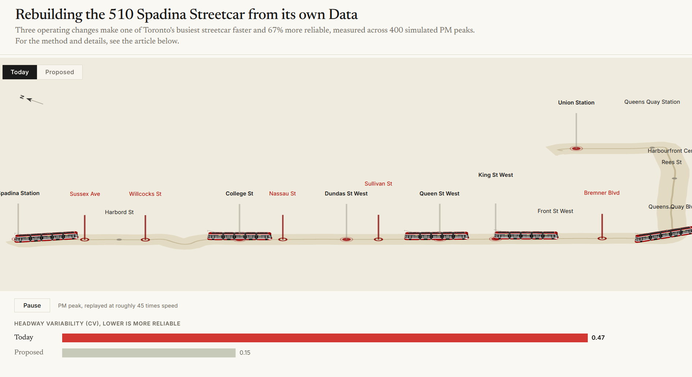

# Rebuilding the 510 Spadina from its own data

A calibrated simulation of Toronto's 510 Spadina streetcar, built from the line's own
published schedule and delay records, paired with an interactive editorial webapp that replays
what the model produced. The question it answers: how much faster and more reliable could the
510 be if we changed how it is run rather than what it is built from.

The headline result, measured across 400 simulated PM peaks: three operating changes make the
line meaningfully faster and about **67% more reliable**, cutting the variability in the gap
between cars (headway CV) from 0.47 to 0.15.

## How it works

The core is a mechanistic simulation, not a curve fit. Cars run down the corridor one after
another, riders arrive at each stop at a steady rate, and the number waiting when a car pulls
in sets its dwell. A car that falls slightly behind picks up slightly more riders, dwells
slightly longer, and falls further behind, while the car behind catches up. Because streetcars
share one track and cannot pass, they then travel as a bunch. Nothing in the model decides that
the line is slow or clumpy: that behaviour emerges from the mechanics alone.

The baseline is calibrated to two facts measured independently from the data: the scheduled end
to end run time (about 29 minutes) and the headway variability seen in the delay logs. Only
then are three changes applied, each acting on the mechanism and never on the result:

- **Stop consolidation**, removing five stops that sit too close together.
- **Conditional signal priority**, giving late cars a green at signals.
- **Headway holding**, dispatching to an even gap instead of a clock.

Every scenario is run as a 400 replication Monte Carlo ensemble, so each reported number carries
a confidence interval. The simulation is the single source of truth: the webapp does not
re-implement any of it, it replays an exported sample of genuine runs.

### The model package (`src/`)

`config.py` centralizes every constant and path. `geometry.py` rebuilds the corridor from the
real GTFS `stops.txt` and `shapes.txt`. `data.py` loads and cleans the delay records and the
schedule. `simulation.py` is the mechanistic core; `calibrate.py` tunes the baseline to the
measured targets; `interventions.py` defines the three changes; `monte_carlo.py` runs the
ensemble; `export.py` writes `route.json` and `sim.json` into `assets/`.

## Running it locally

```bash
# 1. regenerate the webapp data from the model
python notebooks/export_webapp.py

# 2. rebuild and render the article that sits in the right-hand panel
python notebooks/render_html.py

# 3. serve the site from the repository root with any static server
python -m http.server 8000
#    then open http://localhost:8000
```

The page is plain static files: three.js, d3 and the GLTF and OrbitControls add-ons load as ES
modules from a CDN through the import map, so there is no build step.

## Built with

- [three.js](https://threejs.org/) for the 2.5D diorama and the 3D streetcar model
- [D3](https://d3js.org/) for the reliability chart
- Python (numpy, pandas) for the simulation, calibration and export
- Jupyter and nbconvert for the article

## Data sources

The corridor and calibration are built from the City of Toronto and TTC open data: the TTC GTFS
feed (route shapes and the schedule) and the TTC streetcar delay records.

## Acknowledgements

### Special, special thanks to Jacob L.

The 3D streetcar in the diorama is **not my work**. It is a Flexity Outlook model created by
**Jacob L.** and published on SketchUp 3D Warehouse, and the project would not look the way it
does without it.

- Model: [TTC new low floor streetcar](https://3dwarehouse.sketchup.com/model/166ee52d5726aab3971e77ca4a254c30/TTC-new-low-floor-streetcar)
- Author: [Jacob L. on 3D Warehouse](https://3dwarehouse.sketchup.com/user/0872588832337049077703672/Jacob-L)

The file shipped here (`assets/streetcar.glb`) is a merged and decimated derivative of Jacob L.'s
original model. All credit for the vehicle
design and modelling belongs to Jacob L., the model remains their work, and it is used here with
gratitude and full attribution. If you reuse this project, please keep this credit intact and
respect the original model's 3D Warehouse terms.
