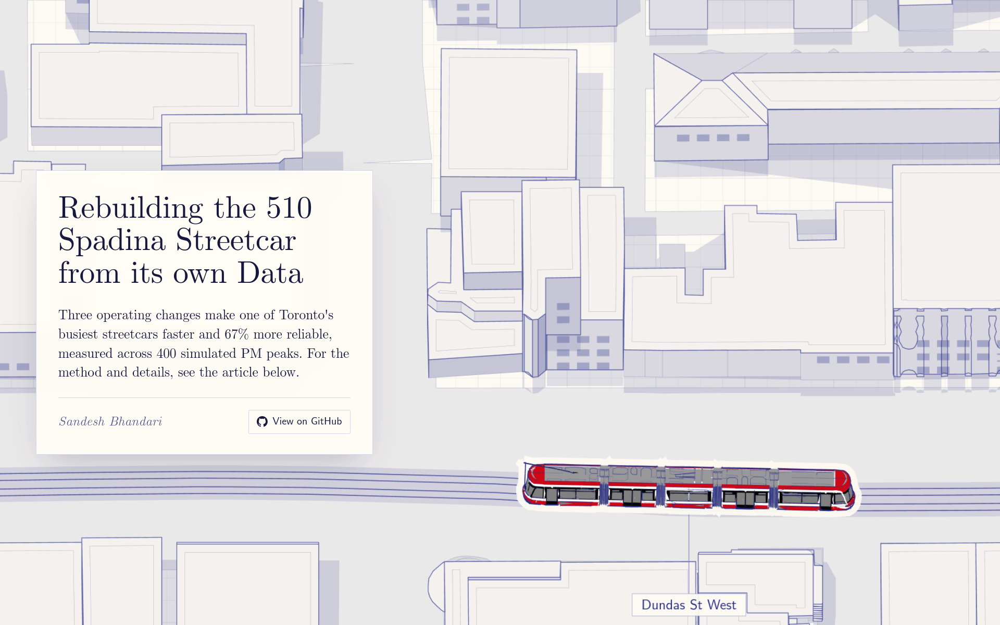

# Rebuilding the 510 Spadina from its own data

A calibrated simulation of Toronto's 510 Spadina streetcar, built from the line's published schedule and delay records, paired with an interactive scrollytelling webapp that replays what the model produced. The question it answers: how much faster and more reliable could the 510 be if we changed how it is run rather than what it is built from?

Across 400 simulated PM peak runs, three operating changes make the line meaningfully faster and roughly **67% more reliable**, cutting the gap variability between cars (headway CV) from 0.47 to 0.15.

## How it works

The core is a mechanistic simulation, not a curve fit. Streetcars run down the corridor one after another, riders arrive at each stop at a steady rate, and the number waiting when a car pulls in sets its dwell time. A car that falls slightly behind picks up slightly more riders, dwells longer, and falls further behind, while the car behind catches up. Because streetcars share a single track and cannot pass, they clump together. Nothing in the model forces the line to be slow or bunched; that behavior emerges entirely from the mechanics.

The baseline is calibrated against two facts measured independently from TTC open data: the scheduled end-to-end run time (about 29 minutes) and the headway variability in the delay logs. From there, three operating changes are tested:

- **Stop consolidation**: removing five stops that sit too close together.
- **Conditional signal priority**: giving late cars a green light at signals.
- **Headway holding**: dispatching and holding to an even time gap instead of a clock schedule.

Each scenario is evaluated with a 400-run Monte Carlo ensemble to produce confidence intervals. The simulation is the single source of truth: the webapp does not recalculate anything in the browser, it replays genuine runs.

## Architecture

### The simulation package (`src/`)

The Python package in `src/` runs the model and exports the data:

- `config.py` — corridor constants, targets, and paths.
- `data.py` — loads and cleans TTC delay logs and GTFS schedule records.
- `geometry.py` — reconstructs the corridor geometry and stop spacing from GTFS feeds.
- `demand.py` — rider boarding and arrival rates along the route.
- `simulation.py` — mechanistic simulation core (dwells, signal waits, single-track physics).
- `calibrate.py` — tunes cruise speed and link noise to match real-world targets.
- `interventions.py` — applies the three operating changes to the corridor.
- `monte_carlo.py` — runs multi-scenario ensembles and aggregates results.
- `metrics.py` — computes travel time percentiles, speeds, headway CV, and bunching rates.
- `viz.py` — generates Marey time-space diagrams, CDF curves, and sensitivity plots.
- `export.py` — writes simulation runs and route keypoints to `assets/route.json` and `assets/sim.json`.

The full analysis walk-through and figure generation live in `notebook/510_spadina.ipynb`.

### The webapp (`index.html`, `app.*.js`, `tape/`)

The web frontend is a scrollytelling visual article built with **June**, my custom JavaScript visualization engine:

- **Scrollytelling stage**: As you scroll through the article cards, the June web runtime replays vector tape frames (`tape/`) on a sticky canvas using WebGL2 (with 2D canvas fallback) at 30 fps.
- **Corridor explorer**: An interactive section at the bottom lets readers pause and watch streetcars run the full PM peak corridor at roughly 45× real-time speed.
- **Zero build dependencies**: The web client runs entirely on static files with local web fonts (Computer Modern). No node packages, CDN scripts, or external 3D libraries are needed.

## Built with

- **June** — custom JavaScript visualization engine for the scrollytelling canvas and playback.
- **Python** (NumPy, pandas, Matplotlib) — simulation mechanics, calibration, Monte Carlo runs, and plotting.
- **Jupyter** — analysis notebook and interactive figures.

## Data sources

- City of Toronto and TTC Open Data:
  - TTC GTFS feed (route shapes and scheduled service)
  - TTC streetcar delay logs (2024–2026)

## Credits

- Streetcar 3D model asset (`assets/streetcar.glb`): derived from Jacob L.'s Flexity Outlook streetcar model on SketchUp 3D Warehouse.
